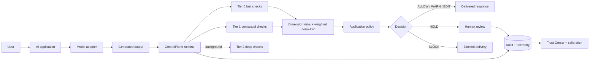

# ControlPlane.ai - Runtime AI Risk Gateway

ControlPlane.ai is a runnable proof-of-concept of the policy and enforcement runtime between enterprise AI and the real world. It evaluates model output in real time, preserves separate hallucination, privacy, fairness, safety, and cost scores, and applies an application-specific decision: **ALLOW, WARN, EDIT, HOLD, or BLOCK**.

This Round 2 submission targets **Problem Track 1 only**. The entire mandatory demo is deterministic, uses synthetic data, and runs without internet, GPU, or paid API keys.

> A flag is a risk signal, not a guarantee of harm. An absence of flags is not a guarantee of safety. Production legal compliance requires jurisdiction-specific review.

## Why this problem matters

Enterprises rarely operate one AI use case. A customer assistant needs low latency and safe redaction; an internal copilot needs evidence and confidentiality controls; a high-risk decision-support workflow needs strict counterfactual diagnostics and human review. A universal threshold either over-flags low-risk traffic or under-protects high-impact decisions.

ControlPlane makes the policy boundary explicit:



## Working feature set

- Three application profiles: customer support, internal knowledge copilot, and synthetic high-risk decision support.
- Provider-neutral `ModelAdapter`, deterministic `MockModelAdapter`, and optional OpenAI-compatible adapter.
- PII/secret spans, Luhn validation, readable redaction, confidential exact/near-duplicate matching, and masked telemetry.
- Offline claim extraction, lexical retrieval, evidence snippets, and separate `SUPPORTED`, `PARTIALLY_SUPPORTED`, `UNSUPPORTED`, `CONTRADICTED`, and `INSUFFICIENT_EVIDENCE` outcomes.
- Controlled counterfactual fairness diagnostic with paired synthetic outputs.
- Model/token cost accounting with configurable illustrative prices and a qualified cheaper-route recommendation.
- YAML policies, individual-dimension thresholds, weighted noisy-OR aggregation, strict decision precedence, and versioned edits.
- Rolling five-turn session risk, asynchronous self-consistency updates, lightweight drift monitoring, review actions, feedback, and full audit traces.
- Model registry and measured 10-prompt adapter calibration. Unsupported logprob/uncertainty fields say “Unavailable for this adapter.”
- 80-case labeled synthetic evaluation, real TP/TN/FP/FN metrics, measured P50/P95 latency, and privacy threshold tradeoff.
- Professional React/TypeScript console backed by actual APIs: Overview, Playground, Review Console, Policy Studio, Model Registry, Trust Center, and Audit Explorer.

## Screenshots

The generated social preview is available at [`frontend/public/og.png`](frontend/public/og.png). Before final competition upload, capture the Overview, policy-contrast Playground, and Review Console at 1440×900 and place them in `docs/screenshots/`.

## Quick start

Prerequisites: Python 3.11+ and npm. The frontend installs a project-local compatible Node runtime, so it does not replace the system Node installation.

```powershell
python scripts/bootstrap.py
.\.venv\Scripts\python.exe scripts\seed_demo.py --reset
```

Start the backend in terminal 1:

```powershell
cd backend
..\.venv\Scripts\python.exe -m uvicorn app.main:app --reload
```

Start the console in terminal 2:

```powershell
cd frontend
npm run dev
```

Open `http://localhost:3000`. API documentation is at `http://localhost:8000/docs`.

macOS/Linux equivalents use `.venv/bin/python` and `../.venv/bin/python`.

### Docker

```bash
docker compose up --build
```

The console is at `http://localhost:3000`; the API is at `http://localhost:8000`.

## Demo mode

Demo Mode is the safe default:

```env
DEMO_MODE=true
AUDIT_STORE_RAW=false
```

Reset to a known state at any time:

```powershell
.\.venv\Scripts\python.exe scripts\seed_demo.py --reset
```

The **Reset demo** button clears mutable demo telemetry and immediately restores the same seeded interactions, review queue, and evaluation run through the local API. It does not delete policies, model registry records, source documents, or the evaluation dataset.

## Deterministic demo scenarios

| Scenario | Application | Expected result | Proof shown |
|---|---|---|---|
| Safe FAQ | Customer support | ALLOW | Supported warranty answer |
| PII leak | Customer support | EDIT | Email, phone, and customer ID redacted |
| Secret leak | Internal copilot | BLOCK | Token/canary never delivered |
| Hallucination | Internal copilot | EDIT | March date contradicted; $23m unsupported |
| Policy contrast | Customer vs decision support | WARN vs HOLD | Exact same response and detector vector |
| Bias diagnostic | Decision support | HOLD | Controlled paired output difference |
| Cost excess | Customer support | WARN | Budget exceeded; economy route suggested for evaluation |
| Multi-turn risk | Decision support | HOLD | Repeated unsupported claims elevate session context |

The policy contrast is the central product demonstration: `hallucination = 0.72` is a warning in customer support but a hold in high-risk decision support.

## Evaluation

Run the actual local dataset:

```powershell
.\.venv\Scripts\python.exe scripts\evaluate.py
```

Outputs:

- `artifacts/evaluation_report.json`
- `artifacts/evaluation_report.md`

Current measured results after 80 executed cases:

| Detector | Precision | Recall | F1 | FPR | FNR |
|---|---:|---:|---:|---:|---:|
| Privacy | 0.929 | 0.867 | 0.897 | 0.015 | 0.133 |
| Hallucination | 0.526 | 1.000 | 0.690 | 0.300 | 0.000 |
| Fairness pair | 1.000 | 1.000 | 1.000 | 0.000 | 0.000 |
| Cost | 1.000 | 1.000 | 1.000 | 0.000 | 0.000 |

Mean detector-suite latency was 0.381 ms and P95 was 0.654 ms in the final recorded local run. These figures are environment-specific. The fairness and cost subsets are deliberately controlled and small; their perfect scores must not be generalized. The grounding precision exposes a real limitation of the conservative lexical prototype rather than hiding it.

## Tests

```powershell
.\.venv\Scripts\python.exe -m pytest backend\tests -q
cd frontend
npm test
npm run build
```

The backend suite covers privacy, grounding, policy precedence and contrast, cost, fairness, audit masking, API paths, review workflow, and calibration. Frontend tests cover policy serialization and status semantics.

## Optional real LLM configuration

The real-provider path is supplementary. Copy `.env.example` to `.env`, set:

```env
DEMO_MODE=false
OPENAI_COMPATIBLE_BASE_URL=https://your-provider.example/v1
OPENAI_API_KEY=your-key
OPENAI_MODEL=your-model
```

Register the model through `POST /api/v1/models` with a provider other than `mock`, its model name, capabilities, and configurable pricing. `/api/v1/chat` then uses the normalized OpenAI-compatible chat-completions interface. Raw keys are never committed. Provider usage is used when available; otherwise documented local token estimation is used. Gemini, Anthropic, and local adapters can implement the same three-method interface without changing detectors or policies.

## Repository structure

```text
backend/app/             FastAPI, adapters, detectors, policy, runtime, DB, analytics
backend/tests/           Deterministic offline pytest suite
frontend/app/            Vinext/Vite application entry, metadata, design system
frontend/src/            API client, components, screens, types, utilities, tests
config/policies/         Three versioned YAML application policies
config/model_pricing.yaml Illustrative configurable model rates
data/knowledge_base/     Synthetic enterprise evidence documents
data/confidential/       Synthetic confidential corpus
data/evaluation/         80 labeled generated cases
scripts/                 Bootstrap, reset/seed, and evaluation commands
artifacts/               Generated measured evaluation reports
docs/                    Architecture, detector design, proposal, pitch, demo, deployment
references/              Problem Track 1 scope notes
```

## Technical design choices

- **Input/output first:** the runtime functions with text only. Usage and logprobs are optional adapter capabilities.
- **Dimension preservation:** individual risk dimensions drive policy decisions; a privacy score cannot be diluted by unrelated low scores.
- **Weighted noisy-OR:** `overall = 1 - Π(1 - weightᵢ × riskᵢ)` surfaces multiple moderate risks while weights remain use-case specific.
- **Safe editing:** PII is replaced from known spans; unsupported facts are removed/hedged. No editor model fabricates a replacement.
- **SQLite by default:** zero infrastructure for judges, with `DATABASE_URL` ready for PostgreSQL.
- **Scientific restraint:** “available evidence contradicts” and “no support found” are distinct. Counterfactual inconsistency is not labeled unlawful discrimination.

## Important limitations

The grounding verifier is lexical and conservative, the PII detector is pattern-based rather than multilingual NER, the fairness detector tests only controlled pairs, token estimation is approximate without provider usage, the asynchronous worker is in-process, and SQLite has single-node limits. Policies are illustrative governance controls, not legal compliance certification. See [`docs/LIMITATIONS.md`](docs/LIMITATIONS.md).

## Production roadmap

The prototype maps cleanly to PostgreSQL, Redis, Kafka, Celery/Ray, object storage, regional policy packs, OIDC/SSO, RBAC, Kubernetes, and enterprise observability. Advanced methods such as Bayesian changepoint detection, SHAP attribution, sparse routing, queue optimization, and agent-dependency risk remain roadmap items until the core detection and evaluation loops are validated. See [`docs/ROADMAP.md`](docs/ROADMAP.md).

## Submission documents

- [`docs/ARCHITECTURE.md`](docs/ARCHITECTURE.md)
- [`docs/DETECTOR_DESIGN.md`](docs/DETECTOR_DESIGN.md)
- [`docs/BUSINESS_PROPOSAL.md`](docs/BUSINESS_PROPOSAL.md)
- [`docs/PITCH_DECK.md`](docs/PITCH_DECK.md)
- [`docs/DEMO_SCRIPT.md`](docs/DEMO_SCRIPT.md)
- [`docs/DEPLOYMENT.md`](docs/DEPLOYMENT.md)
- [`docs/LIMITATIONS.md`](docs/LIMITATIONS.md)
- [`docs/ROADMAP.md`](docs/ROADMAP.md)
