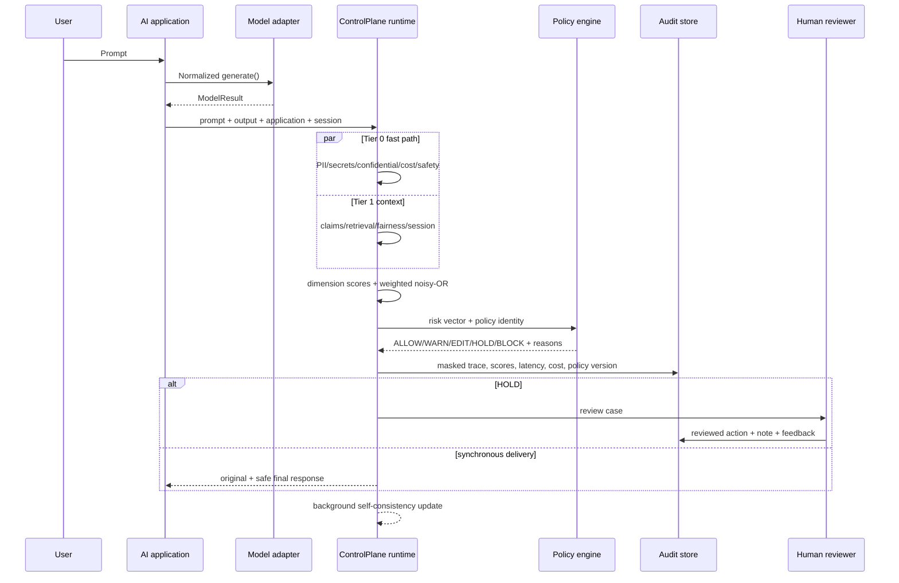
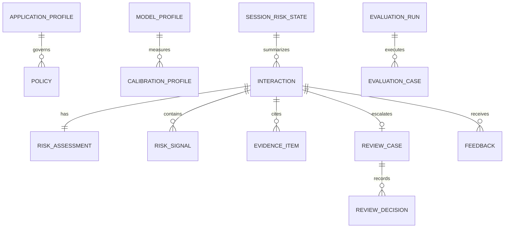
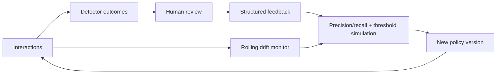

# ControlPlane.ai Architecture

## 1. Architectural intent

ControlPlane is an inline, model-independent policy boundary. It does not assume model internals, a particular provider, or perfect ground truth. The minimum adapter capability is text output. Token usage, logprobs, streaming, and other signals are declared capabilities and used only when genuinely available.

The prototype is a complete single-node vertical slice: FastAPI, SQLAlchemy, SQLite, in-process background tasks, and a React/TypeScript console. Its component boundaries map to distributed production services without making that infrastructure mandatory for the demonstration.

## 2. Request flow

## 3. Core components

### Model capability adapter

`ModelAdapter` defines `generate`, `capabilities`, and `estimate_cost`. `ModelResult` normalizes text, token usage, model/provider identity, latency, optional logprobs, and metadata. The deterministic mock adapter covers every mandatory scenario; the optional OpenAI-compatible adapter calls a chat-completions endpoint when configured.

### Model registry and calibration

`ModelProfile` stores provider, model, capability level, context length, configurable rates, and signal availability. Calibration runs 10 benign prompts and stores measured mean latency, mean output tokens, and cost. Unavailable uncertainty is stored as unavailable, not fabricated.

### Tiered detector execution

- **Tier 0:** PII/secret spans, confidential corpus, cost/output anomaly, and basic safety patterns. It always runs and has no network dependency.
- **Tier 1:** claim extraction, local evidence retrieval, claim/evidence status, fairness pair diagnostics, aggregation, policy evaluation, and session context.
- **Tier 2:** three-sample lexical/entity self-consistency in a FastAPI background task. The initial response is not delayed. The audit event moves from `queued` to `complete`.

The prototype executes Tier 0 checks sequentially because each is sub-millisecond in the measured dataset. A production worker can execute independent checks in parallel.

### Risk detector contract

Every detector returns name, risk type, 0-1 score, confidence, severity, masked signals, evidence, recommended action, and measured elapsed milliseconds. Full secret values are never returned in ordinary detector output.

### Aggregation

Separate hallucination, privacy, bias, safety, and cost scores are retained. Multiple detectors in one dimension use the maximum score. Overall risk uses application weights:

`overall = 1 - PRODUCT(1 - weight_i * risk_i)`

This weighted noisy-OR increases when several risks co-occur. The policy engine still evaluates every dimension directly, so a critical privacy score cannot be averaged away.

### Policy engine

Policies originate in YAML and are persisted/versioned in SQL. They contain metadata, risk weights, per-dimension thresholds, budgets, latency target, and mandatory human-review conditions. Precedence is deterministic:

`BLOCK > HOLD > EDIT > WARN > ALLOW`

Every matched threshold becomes a human-readable reason stored with the trace.

### Automated editing

Privacy editing replaces exact detected spans with type labels. Confidential exact phrases become `[CONFIDENTIAL]`. Claim editing only removes/hedges unsupported or contradicted text with “I could not verify this claim from the available sources.” No model is asked to invent a corrected fact.

### Session risk

The last five turns are weighted 0.40, 0.25, 0.16, 0.11, and 0.08. Two or more previous turns with hallucination risk at or above 0.55 elevate the session. A subsequent risky claim receives a bounded +0.12 hallucination adjustment and an explicit explanation. This avoids blindly summing scores forever.

### Human review and feedback

`ReviewCase` points to the immutable machine trace. Actions are approve original, approve edited, manual edit, block, or mark false positive. Manual override and false-positive actions require notes. The record stores reviewer, timestamp, previous machine decision, policy version, and final response. Structured feedback supports later threshold simulation; the prototype does not claim online retraining.

### Audit and privacy of ControlPlane

Every trace stores application/model/session, policy version, detectors, latencies, dimension risks, overall risk, model usage/cost, machine/final decision, edit action, review status, and deep-check status. With `AUDIT_STORE_RAW=false`, ordinary storage contains redacted text plus a SHA-256 hash. Detected secrets appear only as typed masks.

## 4. Persistence model

Automatic table creation is acceptable for this prototype and documented. Production should use Alembic migrations, PostgreSQL constraints, tenant partitioning, retention policies, and encrypted columns/object storage where needed.

## 5. API boundaries

`/api/v1/chat` generates and checks; `/check` accepts external output. Application, policy, model/calibration, incident, review, feedback, analytics, evaluation, health, and deterministic demo endpoints are separately versioned. FastAPI publishes an OpenAPI contract at `/docs`.

## 6. Frontend architecture

The Vinext/Vite React console uses a typed API client and distinct operational screens. It contains no hardcoded telemetry KPIs: dashboard, charts, incidents, evaluations, review volume, latency, cost, registry data, and drift all come from the backend. If the runtime is unavailable, it shows an explicit connection state rather than fabricated values.

## 7. Feedback and calibration loop

No automatic threshold is silently promoted. A human governance owner reviews evidence and saves a new version.

## 8. Production scalability mapping

| Prototype | Production mapping |
|---|---|
| SQLite | PostgreSQL with tenant/region partitioning |
| FastAPI background task | Celery/Ray workers over Redis/Kafka |
| Local Markdown knowledge | Versioned object storage + governed retrieval service |
| Single API process | Kubernetes gateway and horizontally scaled risk workers |
| Local policy records | Signed regional policy packs and approval workflow |
| Demo reviewer identity | OIDC/SSO, RBAC, least privilege, separation of duties |
| Console metrics | OpenTelemetry, metrics/log/trace backend, enterprise SIEM |

Streaming can emit provisional Tier 0 results while contextual checks continue; the final delivery gate must still honor policy. Kafka topics can separate interactions, detector outcomes, review events, and feedback. Idempotent trace IDs and an outbox pattern prevent audit gaps.

## 9. Failure behavior

The prototype raises explicit API errors for unknown applications/models and never silently changes provider. Production policy should define fail-open or fail-closed behavior per application and detector. A high-risk decision workflow should generally fail closed or hold on checker unavailability; a low-risk FAQ might return a degraded warning. These are governance choices, not universal defaults.
