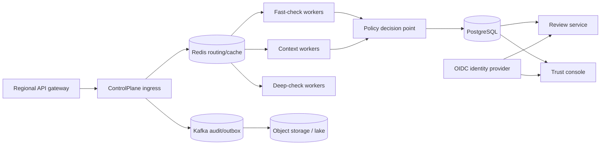

# Deployment and Operations

## Local competition setup

### Prerequisites

- Python 3.11+
- npm with network access for the first install
- No API key, database server, GPU, or external model

### Install and seed

```powershell
python scripts/bootstrap.py
.\.venv\Scripts\python.exe scripts\seed_demo.py --reset
```

### Run

Backend:

```powershell
cd backend
..\.venv\Scripts\python.exe -m uvicorn app.main:app --reload --port 8000
```

Frontend:

```powershell
cd frontend
npm run dev
```

The UI uses `NEXT_PUBLIC_API_URL`, defaulting to `http://localhost:8000/api/v1`. FastAPI allows the configured `FRONTEND_ORIGIN`, default `http://localhost:3000`.

## Environment variables

| Variable | Safe default | Purpose |
|---|---|---|
| `DEMO_MODE` | `true` | Deterministic mock provider |
| `DATABASE_URL` | SQLite in repository root | SQLAlchemy storage; PostgreSQL-compatible setting |
| `AUDIT_STORE_RAW` | `false` | Store masked response and hash instead of raw content |
| `FRONTEND_ORIGIN` | `http://localhost:3000` | CORS allowlist |
| `NEXT_PUBLIC_API_URL` | `http://localhost:8000/api/v1` | Browser API endpoint |
| `OPENAI_COMPATIBLE_BASE_URL` | OpenAI-compatible `/v1` URL | Optional provider base |
| `OPENAI_API_KEY` | empty | Optional provider secret; never commit |
| `OPENAI_MODEL` | empty | Optional provider model |

Copy `.env.example`; do not commit `.env`. The prototype does not load an env file automatically in Python code, but `uvicorn[standard]` can use `--env-file ../.env`, Docker Compose can supply variables, or the shell can export them.

## Docker Compose

```bash
docker compose up --build
```

SQLite persists in the named `controlplane_data` volume at `/workspace/state`. The frontend is built with a browser-reachable API URL of `http://localhost:8000/api/v1`.

## Validation commands

```powershell
.\.venv\Scripts\python.exe -m pytest backend\tests -q
.\.venv\Scripts\python.exe scripts\evaluate.py
cd frontend
npm test
npm run build
```

## Optional real provider

Set the compatible base URL and key, register a non-mock model through `/api/v1/models`, and select it in the application. Provider credentials belong in a secrets manager in production. Network errors are surfaced; the runtime does not silently fall back to mock output when Demo Mode is expected to be off.

## Prototype reset/retention

`scripts/seed_demo.py --reset` clears demo interaction/review/feedback/evaluation tables and restores known scenarios plus a measured evaluation run. The UI Reset button performs the same complete restore through the API. Source knowledge, confidential fingerprints, models, and policies are retained. For competition rehearsal, reset immediately before opening the UI.

## Production topology



### Required production controls

- PostgreSQL migrations, backups, tenant/time partitioning, and row-level access controls;
- Redis/Kafka with idempotent trace IDs, durable outbox, retry/dead-letter policy;
- Celery/Ray workers with detector-specific timeouts and resource budgets;
- object storage for versioned evidence and encrypted retained artifacts;
- OIDC/SSO, RBAC, reviewer separation of duties, and privileged-action audit;
- TLS, secrets manager, customer-managed keys where required, and regional residency;
- OpenTelemetry traces/metrics/logs, SIEM integration, SLOs, and on-call runbooks;
- signed policy packs with approvals, effective dates, rollback, and expiry review;
- explicit fail-open/fail-closed/degraded behavior per application.

## Scale assumptions

The challenge’s directional tens-of-thousands weekly interactions fit the prototype mechanism, but SQLite and one process are not a production capacity claim. Stateless API replicas scale horizontally. Fast checks can run inline; contextual/deep detectors become workers. Review and analytics scale independently from the delivery gate.

## Rollout plan

1. Shadow mode: score/store without intervention; compare against human labels.
2. WARN only: validate user experience and false-positive response.
3. EDIT for high-confidence PII spans; retain safe rollback.
4. HOLD/BLOCK for approved high-impact rules with reviewer/on-call coverage.
5. Expand applications only after per-use-case evaluation and policy ownership.
